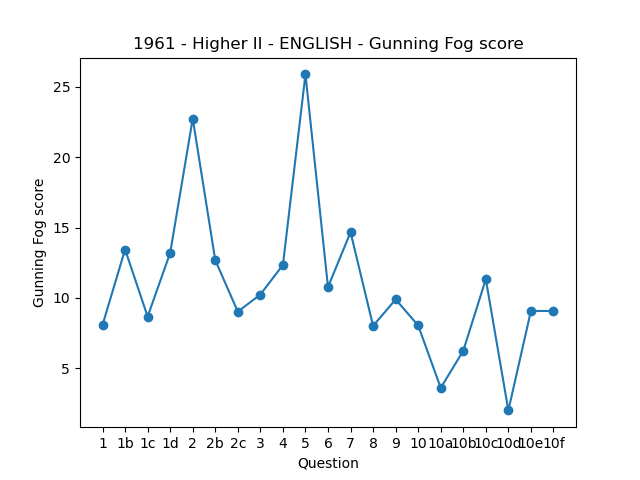

# Linguistic Analysis of Scottish School Exam Papers #
## Intent ##

Data available at: https://data.nls.uk/data/digitised-collections/scottish-exams/
The Scottish School Exam Papers dataset provides a unique opportunity to explore how the language used in education reflects evolving societal, pedagogical, and linguistic trends. By examining the phrasing, structure, and vocabulary of exam questions over time, this project aims to uncover shifts in accessibility, inclusivity, and readability within Scotland's education system. Such an analysis can offer insights into how language in assessments aligns with broader historical, social, and educational changes.

By measuring linguistic features such as sentence length, complexity, and vocabulary diversity, trends in the evolution of exam question readability can be identified. For instance, earlier exams may reveal long, complex sentence structures reflective of 19th-century academic norms, while more modern exams could display shorter, more direct phrasing influenced by contemporary pedagogical principles emphasising clarity and accessibility.

Another dimension of the analysis focuses on inclusivity in language. Historical exams may reveal implicit biases in phrasing or content, such as gendered language or cultural assumptions that privilege specific societal groups. Tracking changes in the language used to describe historical figures, literature, or scientific phenomena can highlight how educational materials have adapted to incorporate broader perspectives and ensure representation.

## Progress ##
* Done
  * Read NLS text files
  * Split into question (1, 2, 3, etc.)
  * Split into subquestions (a, b, c, etc.)
  * Perform "coleman liau", "flesch kincaid", and "gunning fog" analysis on questions and subquestions
  * Output to CSV
  * Create and save labelled plots of "gunning fog" score per paper

## Testing and development ##
The first test uses English papers from 1901, 1961, and 2024 and calculates their per-question Gunning Fog Index.

The Gunning Fog Index is a metric used to measure the readability of a text, developed by Robert Gunning, an American businessman, in 1952.

It considers the number of sentences, number of words, and the number of complex words consisting of three or more syllables in the text. The lower the index score, the easier it is for readers to understand what they are reading.

Here is the Gunning fog readability formula for a passage around 100 words.
0.4 × ((total words ÷ total sentences) + 100 × total complex words ÷ total words)

An example output for a 1961 English Higher exam paper:

|year|level    |subject|question|text                                                                                                                          |coleman_liau|flesch_kincaid|gunning_fog|
|----|---------|-------|--------|------------------------------------------------------------------------------------------------------------------------------------------------------------------------------------------------------------------------------------------------------------------------------------------------------------------------------------------------------------------------------------------------------------------------------------------------------------------------------------------------------------------------------------------------------------------------------------------------------------------------------------------------|------------|--------------|-----------|
|1961|Higher II|ENGLISH|1. (a)  |Select any one of Shakespeare’s comedies. To what extent is it a comedy of situation, and to what extent a comedy of character ?                                                                                                                                                                                                                                                                                                                                                                                                                                                                                                                |8.33        |5.4           |8.08       |
|1961|Higher II|ENGLISH|1. (a)b |) “ In reading a tragedy of Shakespeare’s we are left with an overwhelming impression of the essential greatness of human character, and we are also conscious of a profound feeling of waste.” Discuss this statement with reference to one, or more than one, of Shakespeare’s tragedies.                                                                                                                                                                                                                                                                                                                                                     |12.25       |9.7           |13.44      |
|1961|Higher II|ENGLISH|1. (a)c |) Discuss the element of patriotism in one, or more than one, of Shakespeare’s history plays.                                                                                                                                                                                                                                                                                                                                                                                                                                                                                                                                                   |10.37       |6.8           |8.67       |
|1961|Higher II|ENGLISH|1. (a)d |) From your reading of Shakespeare’s plays, choose a comic scene from a comedy and a comic scene from a tragedy ;' describe each briefly, and show in a paragraph how they serve different purposes.                                                                                                                                                                                                                                                                                                                                                                                                                                            |10.57       |12.6          |13.2       |

And a plot of the complete paper showing the Gunning Fog score per question:

